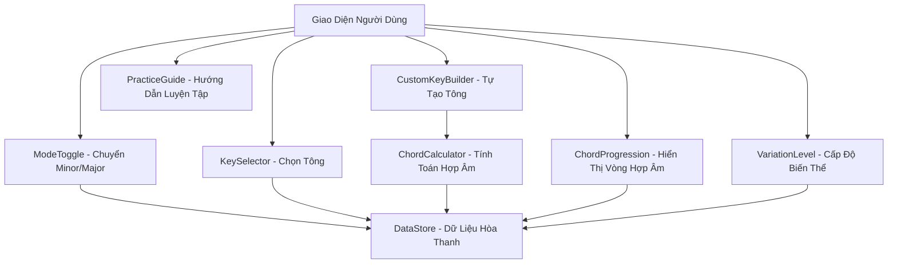
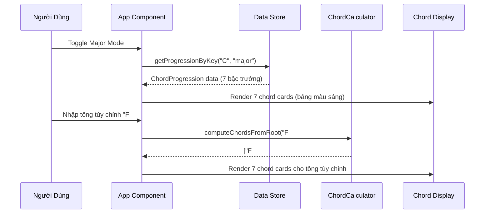

# Tài Liệu Thiết Kế: Chord Progression Webapp (v3.0.0)

## Tổng Quan

Chord Progression Analyzer là một webapp âm nhạc cho phép nhạc sĩ khám phá và thực hành vòng hòa thanh. Phiên bản 3.0.0 mở rộng đáng kể so với v2.0.0 với 3 tính năng lớn:

1. **Chế Độ Trưởng (Major Mode)**: Bên cạnh vòng thứ `i - iv - VII - III - VI - ii° - V7`, thêm vòng trưởng `I - IV - vii° - iii - vi - ii - V7` với bảng màu sáng/vàng/cam. Người dùng có thể toggle giữa Minor Mode và Major Mode.
2. **12 Tông Đầy Đủ**: Mở rộng từ 7 tông cố định lên toàn bộ 12 tông chromatic cho cả minor và major, với đánh dấu riêng cho các tông phổ biến trong nhạc Việt Nam.
3. **Custom Key Builder**: Người dùng nhập tông bất kỳ và hệ thống tự tính toán các hợp âm theo công thức dựa trên chromatic scale và interval patterns.

Mục tiêu cốt lõi là giúp người học nhạc hiểu được logic hòa thanh đằng sau công thức — không chỉ đơn thuần ghi nhớ các hợp âm — từ đó có thể tự suy luận và ứng dụng vào sáng tác.

---

## Kiến Trúc Hệ Thống





---

## Logic Hòa Thanh — Mindset của Vòng 7 Bậc

### Vòng Thứ (Minor Mode): `i - iv - VII - III - VI - ii° - V7`

| Bậc | Ký hiệu | Tên | Vai trò cảm xúc |
|-----|---------|-----|-----------------|
| 1 | i | Tonic thứ | Thiết lập màu sắc tối, buồn — là "nhà" |
| 4 | iv | Subdominant thứ | Củng cố màu thứ, tạo cảm giác nặng nề, kéo xuống |
| 7 | VII | Subtonic trưởng | Chuyển sang màu sáng hơn, mở ra không gian |
| 3 | III | Mediant trưởng | Tiếp tục sáng, tạo chiều sâu và kịch tính |
| 6 | VI | Submediant trưởng | Cầu nối hạ nhiệt, cảm xúc lắng xuống |
| 2 | ii° | Supertonic giảm | Tạo tension tột độ, các nốt hút kéo về bậc 1 |
| 5 | V7 | Dominant 7 | Giải quyết (resolution) hoàn hảo, kéo mạnh về i |

### Vòng Trưởng (Major Mode): `I - IV - vii° - iii - vi - ii - V7`

| Bậc | Ký hiệu | Tên | Vai trò cảm xúc |
|-----|---------|-----|-----------------|
| 1 | I | Tonic trưởng | Thiết lập màu sắc sáng, vui — là "nhà" |
| 4 | IV | Subdominant trưởng | Mở rộng không gian, tạo cảm giác phấn khởi |
| 7 | vii° | Leading tone giảm | Tạo tension, kéo mạnh về bậc 1 |
| 3 | iii | Mediant thứ | Thêm chiều sâu, màu sắc trung gian |
| 6 | vi | Submediant thứ | Cầu nối cảm xúc, tạo tương phản nhẹ |
| 2 | ii | Supertonic thứ | Chuẩn bị cho dominant |
| 5 | V7 | Dominant 7 | Giải quyết hoàn hảo về I |

---

## Thành Phần và Giao Diện

### Component 1: `KeySelector`

**Mục đích**: Cho phép người dùng chọn tông từ danh sách 12 tông được hỗ trợ (theo mode hiện tại).

**Giao diện**:
```typescript
interface KeySelectorProps {
  keys: MusicalKey[]
  selectedKey: string
  onKeyChange: (key: string) => void
}
```

**Trách nhiệm**:
- Hiển thị các tông dưới dạng các nút bấm (pill buttons)
- Highlight tông đang được chọn
- Hiển thị badge "🇻🇳 Nhạc Việt" cho các tông phổ biến trong nhạc Việt Nam
- Gọi callback khi người dùng thay đổi tông

---

### Component 2: `ModeToggle`

**Mục đích**: Cho phép người dùng chuyển đổi giữa Minor Mode và Major Mode.

**Giao diện**:
```typescript
interface ModeToggleProps {
  currentMode: ScaleMode
  onModeChange: (mode: ScaleMode) => void
}
```

**Trách nhiệm**:
- Hiển thị toggle button với 2 trạng thái: "Minor" và "Major"
- Minor Mode: bảng màu tối/xanh đậm
- Major Mode: bảng màu sáng/vàng/cam
- Khi chuyển mode, reset về tông mặc định của mode đó (Minor → Em, Major → C)

---

### Component 3: `ChordProgressionDisplay`

**Mục đích**: Hiển thị 7 hợp âm trong vòng progression với thông tin hòa thanh.

**Giao diện**:
```typescript
interface ChordProgressionDisplayProps {
  progression: ChordProgression
  selectedLevel: SkillLevel
}
```

**Trách nhiệm**:
- Render 7 card hợp âm theo thứ tự công thức tương ứng với mode
- Hiển thị tên hợp âm, bậc (Roman numeral), và vai trò hòa thanh
- Highlight màu sắc theo chức năng: Tonic (xanh lam), Subdominant (xanh lá), Dominant (đỏ/cam)

---

### Component 4: `VariationPanel`

**Mục đích**: Hiển thị các biến thể và gợi ý theo cấp độ kỹ năng.

**Giao diện**:
```typescript
interface VariationPanelProps {
  variations: VariationSet
  activeLevel: SkillLevel
  onLevelChange: (level: SkillLevel) => void
}
```

**Trách nhiệm**:
- Hiển thị 3 tab: Beginner / Intermediate / Advanced
- Render danh sách gợi ý tương ứng với cấp độ đang chọn
- Giải thích ngắn gọn lý do âm nhạc của từng biến thể

---

### Component 5: `PracticeGuide`

**Mục đích**: Hướng dẫn luyện tập từng bước (4 bước).

**Giao diện**:
```typescript
interface PracticeGuideProps {
  steps: PracticeStep[]
}
```

**Trách nhiệm**:
- Hiển thị 4 bước luyện tập theo thứ tự
- Có thể mở rộng/thu gọn từng bước

---

### Component 6: `MoodBadge`

**Mục đích**: Hiển thị cảm xúc và màu sắc âm nhạc của vòng hòa thanh.

**Giao diện**:
```typescript
interface MoodBadgeProps {
  mood: string
  tags: string[]
}
```

---

### Component 7: `CustomKeyBuilder`

**Mục đích**: Cho phép người dùng nhập tông bất kỳ và tự động tính toán vòng hòa thanh.

**Giao diện**:
```typescript
interface CustomKeyBuilderProps {
  onKeyGenerated: (key: MusicalKey) => void
}
```

**Trách nhiệm**:
- Hiển thị input field để nhập root note (vd: "F#", "Bb")
- Hiển thị radio/toggle để chọn mode (minor/major)
- Gọi `computeChordsFromRoot` và trả kết quả về App qua callback
- Hiển thị lỗi nếu root note không hợp lệ

---

## Mô Hình Dữ Liệu

### `ScaleMode`

```typescript
type ScaleMode = "minor" | "major"
```

---

### `MusicalKey`

```typescript
interface MusicalKey {
  id: string                      // vd: "Em", "C"
  label: string                   // vd: "Em (Mi thứ)", "C (Đô trưởng)"
  mode: ScaleMode                 // "minor" | "major"
  chords: string[]                // đúng 7 hợp âm theo công thức
  isVietnamesePopular?: boolean   // true nếu là tông phổ biến trong nhạc Việt
}
```

**Quy tắc kiểm tra**:
- `chords` phải có đúng 7 phần tử
- `id` phải là một trong 12 tông chromatic (hoặc enharmonic equivalents)
- `mode` phải là `"minor"` hoặc `"major"`

---

### `ChordProgression`

```typescript
interface ChordProgression {
  key: MusicalKey
  formula: string[]        // minor: ["i","iv","VII","III","VI","ii°","V7"] | major: ["I","IV","vii°","iii","vi","ii","V7"]
  chordDetails: ChordDetail[]
}

interface ChordDetail {
  degree: string           // vd: "i", "IV", "vii°"
  name: string             // vd: "Em", "F", "Bdim"
  function: HarmonicFunction
  role: string             // mô tả vai trò hòa thanh bằng tiếng Việt
}

type HarmonicFunction = "tonic" | "subdominant" | "dominant"
```

---

### `VariationSet`

```typescript
interface VariationSet {
  key: string
  beginner: string[]       // 2 gợi ý
  intermediate: string[]   // 2 gợi ý
  advanced: string[]       // 3 gợi ý
}
```

---

### `SkillLevel`

```typescript
type SkillLevel = "beginner" | "intermediate" | "advanced"
```

---

### `PracticeStep`

```typescript
interface PracticeStep {
  order: number      // 1–4
  title: string
  description: string
}
```

---

## Thiết Kế Chi Tiết (Low-Level)

### Cấu Trúc Dữ Liệu Tĩnh

Toàn bộ dữ liệu hòa thanh được lưu dưới dạng hằng số tĩnh (static constants), không cần backend.

```typescript
// data/keys.ts
const FORMULA_MINOR: string[] = ["i", "iv", "VII", "III", "VI", "ii°", "V7"]
const FORMULA_MAJOR: string[] = ["I", "IV", "vii°", "iii", "vi", "ii", "V7"]

// 12 tông thứ đầy đủ (chromatic)
const MINOR_KEYS: MusicalKey[] = [
  { id: "Em",  label: "Em (Mi thứ)",          mode: "minor", chords: ["Em",  "Am",  "D",   "G",   "C",   "F#m7b5",       "B7"],  isVietnamesePopular: true  },
  { id: "Am",  label: "Am (La thứ)",          mode: "minor", chords: ["Am",  "Dm",  "G",   "C",   "F",   "Bm7b5",        "E7"],  isVietnamesePopular: true  },
  { id: "Dm",  label: "Dm (Rê thứ)",          mode: "minor", chords: ["Dm",  "Gm",  "C",   "F",   "Bb",  "Em7b5",        "A7"],  isVietnamesePopular: true  },
  { id: "Gm",  label: "Gm (Son thứ)",         mode: "minor", chords: ["Gm",  "Cm",  "F",   "Bb",  "Eb",  "Am7b5",        "D7"]  },
  { id: "Cm",  label: "Cm (Đô thứ)",          mode: "minor", chords: ["Cm",  "Fm",  "Bb",  "Eb",  "Ab",  "Dm7b5",        "G7"]  },
  { id: "Fm",  label: "Fm (Fa thứ)",          mode: "minor", chords: ["Fm",  "Bbm", "Ab",  "Db",  "Gb",  "Bm7b5",        "C7"]  },
  { id: "Bbm", label: "Bbm (Si giáng thứ)",   mode: "minor", chords: ["Bbm", "Ebm", "Ab",  "Db",  "Gb",  "Em7b5",        "F7"]  },
  { id: "D#m", label: "D#m/Ebm (Rê thăng thứ)", mode: "minor", chords: ["D#m", "G#m", "C#",  "F#",  "B",   "E#m7b5",       "A#7"] },
  { id: "G#m", label: "G#m/Abm (Sol thăng thứ)", mode: "minor", chords: ["G#m", "C#m", "F#",  "B",   "E",   "A#m7b5",       "D#7"] },
  { id: "Bm",  label: "Bm (Si thứ)",          mode: "minor", chords: ["Bm",  "Em",  "A",   "D",   "G",   "C#m7b5",       "F#7"] },
  { id: "F#m", label: "F#m (Fa thăng thứ)",   mode: "minor", chords: ["F#m", "Bm",  "E",   "A",   "D",   "G#m7b5",       "C#7"] },
  { id: "C#m", label: "C#m (Đô thăng thứ)",   mode: "minor", chords: ["C#m", "F#m", "B",   "E",   "A",   "D#m7b5",       "G#7"] },
]

// 7 tông trưởng phổ biến (công thức I-IV-vii°-iii-vi-ii-V7)
const MAJOR_KEYS: MusicalKey[] = [
  { id: "C",  label: "C (Đô trưởng)",         mode: "major", chords: ["C",  "F",  "Bdim",  "Em", "Am", "Dm", "G7"],  isVietnamesePopular: true  },
  { id: "G",  label: "G (Sol trưởng)",         mode: "major", chords: ["G",  "C",  "F#dim", "Bm", "Em", "Am", "D7"]  },
  { id: "D",  label: "D (Rê trưởng)",          mode: "major", chords: ["D",  "G",  "C#dim", "F#m","Bm", "Em", "A7"]  },
  { id: "A",  label: "A (La trưởng)",          mode: "major", chords: ["A",  "D",  "G#dim", "C#m","F#m","Bm", "E7"]  },
  { id: "E",  label: "E (Mi trưởng)",          mode: "major", chords: ["E",  "A",  "D#dim", "G#m","C#m","F#m","B7"]  },
  { id: "F",  label: "F (Fa trưởng)",          mode: "major", chords: ["F",  "Bb", "Edim",  "Am", "Dm", "Gm", "C7"],  isVietnamesePopular: true  },
  { id: "Bb", label: "Bb (Si giáng trưởng)",   mode: "major", chords: ["Bb", "Eb", "Adim",  "Dm", "Gm", "Cm", "F7"]  },
]
```

---

### Mô Tả Vai Trò Hòa Thanh (Role Descriptions)

```typescript
const ROLE_DESCRIPTIONS_MINOR: Record<string, string> = {
  "i":   "Tonic thứ — Thiết lập màu sắc tối, buồn, là 'nhà'",
  "iv":  "Subdominant thứ — Củng cố màu thứ, tạo cảm giác nặng nề, kéo xuống",
  "VII": "Subtonic trưởng — Chuyển sang màu sáng hơn, mở ra không gian",
  "III": "Mediant trưởng — Tiếp tục sáng, tạo chiều sâu và kịch tính",
  "VI":  "Submediant trưởng — Cầu nối hạ nhiệt, cảm xúc lắng xuống",
  "ii°": "Supertonic giảm — Tạo tension tột độ, các nốt hút kéo về bậc 1",
  "V7":  "Dominant 7 — Giải quyết (resolution) hoàn hảo, kéo mạnh về i",
}

const ROLE_DESCRIPTIONS_MAJOR: Record<string, string> = {
  "I":    "Tonic trưởng — Thiết lập màu sắc sáng, vui, là 'nhà'",
  "IV":   "Subdominant trưởng — Mở rộng không gian, tạo cảm giác phấn khởi",
  "vii°": "Leading tone giảm — Tạo tension mạnh, kéo về bậc I",
  "iii":  "Mediant thứ — Thêm chiều sâu, màu sắc trung gian",
  "vi":   "Submediant thứ — Cầu nối cảm xúc, tạo tương phản nhẹ",
  "ii":   "Supertonic thứ — Chuẩn bị cho dominant",
  "V7":   "Dominant 7 — Giải quyết hoàn hảo về I",
}
```

---

### Dữ Liệu Biến Thể

```typescript
// data/variations.ts
const VARIATIONS: Record<string, VariationSet> = {
  "Em": {
    key: "Em",
    beginner: [
      "Thay F#m7b5 (ii°) bằng F#m thông thường nếu khó bấm.",
      "Rút gọn thành 4 bậc: Em - D - C - B7 (i - VII - VI - V7) vẫn giữ được màu sắc tốt.",
    ],
    intermediate: [
      "Walking Bass với đảo hợp âm: Em - Am/E - D/F# - G - C - F#m7b5 - B7/D#",
      "Thêm passing chord: C - C#° - F#m7b5 (VI - #iv° - ii°) tạo chromatic motion rất đẹp.",
    ],
    advanced: [
      "Thêm nốt màu (Tensions): Emaj7, Am7, Dmaj7, Gmaj7, Cmaj7 để tăng độ jazz/lofi.",
      "Tritone Substitution cho V7: thay B7 bằng F7 — cách tritone, giải quyết về Em rất chromatic.",
      "Secondary dominant: thêm E7 trước Am (V7/IV) để tăng lực kéo vào bậc 4.",
    ],
  },
  // ... tương tự cho các tông còn lại
}
```

---

### Dữ Liệu Luyện Tập

```typescript
// data/practice.ts
const PRACTICE_STEPS: PracticeStep[] = [
  {
    order: 1,
    title: "Học thuộc 1 tông duy nhất trước",
    description: "Em hoặc Am là dễ nhất trên Guitar. Nắm chắc 7 hợp âm theo thứ tự i - iv - VII - III - VI - ii° - V7.",
  },
  {
    order: 2,
    title: "Dùng vòng ngũ sắc để suy luận tông mới",
    description: "Dùng Circle of Fifths để suy luận các tông tiếp theo theo chiều kim đồng hồ (Em → Bm → F#m...).",
  },
  {
    order: 3,
    title: "Luyện tai nghe (Ear Training)",
    description: "Thử chơi cùng 1 bài nhưng ở 3 tông khác nhau để luyện khả năng nhận biết màu sắc hòa thanh.",
  },
  {
    order: 4,
    title: "Tập từng đoạn 2–3 bậc rồi ghép lại",
    description: "Chia nhỏ: (i - iv), (VII - III), (VI - ii° - V7 - i). Luyện từng đoạn trước khi chơi toàn bộ vòng.",
  },
]
```

---

### Các Hàm Chính với Đặc Tả Hình Thức

#### `getProgressionByKey(keyId: string, mode: ScaleMode): ChordProgression`

```typescript
function getProgressionByKey(keyId: string, mode: ScaleMode): ChordProgression
```

**Điều kiện tiên quyết (Preconditions)**:
- `keyId` là chuỗi không rỗng
- `mode` là `"minor"` hoặc `"major"`
- `keyId` phải thuộc tập tông hợp lệ của `mode` tương ứng

**Điều kiện hậu (Postconditions)**:
- Trả về `ChordProgression` hợp lệ với đúng 7 `chordDetails`
- `result.chordDetails[i].degree === FORMULA_MINOR[i]` (nếu minor) hoặc `FORMULA_MAJOR[i]` (nếu major) với mọi `i ∈ [0, 6]`
- `result.chordDetails[i].name === key.chords[i]`
- Nếu `keyId` không hợp lệ: ném `Error("Key không được hỗ trợ")`

**Bất biến vòng lặp**:
- Khi duyệt qua 7 bậc: mọi `chordDetail` đã tạo đều có `degree`, `name`, `function`, `role` hợp lệ

---

#### `getVariations(keyId: string, level: SkillLevel): string[]`

```typescript
function getVariations(keyId: string, level: SkillLevel): string[]
```

**Điều kiện tiên quyết**:
- `keyId` hợp lệ (như trên)
- `level ∈ { "beginner", "intermediate", "advanced" }`

**Điều kiện hậu**:
- Trả về mảng chuỗi không rỗng (ít nhất 1 phần tử)
- Mỗi phần tử là mô tả biến thể bằng tiếng Việt

---

#### `mapDegreeToFunction(degree: string, mode: ScaleMode): HarmonicFunction`

```typescript
function mapDegreeToFunction(degree: string, mode: ScaleMode): HarmonicFunction
```

**Điều kiện tiên quyết**:
- Minor: `degree ∈ { "i", "iv", "VII", "III", "VI", "ii°", "V7" }`
- Major: `degree ∈ { "I", "IV", "vii°", "iii", "vi", "ii", "V7" }`

**Điều kiện hậu (Minor)**:
- `"i"`, `"iv"` → `"tonic"`
- `"VII"`, `"III"`, `"VI"` → `"tonic"`
- `"ii°"` → `"subdominant"`
- `"V7"` → `"dominant"`

**Điều kiện hậu (Major)**:
- `"I"`, `"iii"`, `"vi"` → `"tonic"`
- `"IV"`, `"ii"`, `"vii°"` → `"subdominant"`
- `"V7"` → `"dominant"`

---

#### `computeChordsFromRoot(root: string, mode: ScaleMode): string[]`

```typescript
function computeChordsFromRoot(root: string, mode: 'minor' | 'major'): string[]
```

**Điều kiện tiên quyết (Preconditions)**:
- `root` phải là một trong 12 nốt chromatic: `C, C#, D, D#, E, F, F#, G, G#, A, A#, B` (hoặc enharmonic equivalents như `Bb`, `Eb`, `Ab`, `Db`, `Gb`)
- `mode` phải là `'minor'` hoặc `'major'`

**Điều kiện hậu (Postconditions)**:
- Trả về mảng đúng 7 hợp âm theo công thức tương ứng với mode
- Mỗi hợp âm là chuỗi tên hợp âm hợp lệ (không rỗng)
- Nếu `root` không hợp lệ: ném `Error("Root note không hợp lệ")`

**Thuật toán**:
```
CHROMATIC_SCALE = ["C","C#","D","D#","E","F","F#","G","G#","A","A#","B"]
MINOR_INTERVALS = [0, 2, 3, 5, 7, 8, 10]   // W-H-W-W-H-W-W
MAJOR_INTERVALS = [0, 2, 4, 5, 7, 9, 11]   // W-W-H-W-W-W-H
DEGREE_SEQUENCE = [0, 3, 6, 2, 5, 1, 4]    // bậc [1,4,7,3,6,2,5] → index [0,3,6,2,5,1,4]

1. Tìm rootIndex = CHROMATIC_SCALE.indexOf(root)
2. Xây dựng scale 7 nốt: scale[i] = CHROMATIC_SCALE[(rootIndex + intervals[i]) % 12]
3. Với mỗi bậc trong DEGREE_SEQUENCE, xây dựng triad/7th chord từ scale note tương ứng
4. Áp dụng chord quality theo bậc (minor/major/diminished/dominant7)
5. Trả về mảng 7 tên hợp âm
```

---

### Thuật Toán Xây Dựng Progression

```pascal
ALGORITHM buildChordProgression(keyId, mode)
INPUT: keyId: String, mode: ScaleMode
OUTPUT: progression: ChordProgression

BEGIN
  key ← findKeyById(keyId, mode)
  
  IF key = NULL THEN
    THROW Error("Key không được hỗ trợ: " + keyId)
  END IF
  
  formula ← IF mode = "minor" THEN FORMULA_MINOR ELSE FORMULA_MAJOR
  roleDescriptions ← IF mode = "minor" THEN ROLE_DESCRIPTIONS_MINOR ELSE ROLE_DESCRIPTIONS_MAJOR
  details ← []
  
  FOR i FROM 0 TO 6 DO
    ASSERT i < LENGTH(formula) AND i < LENGTH(key.chords)
    
    degree    ← formula[i]
    chordName ← key.chords[i]
    func      ← mapDegreeToFunction(degree, mode)
    role      ← roleDescriptions[degree]
    
    details.push({ degree, name: chordName, function: func, role })
  END FOR
  
  ASSERT LENGTH(details) = 7
  
  RETURN { key, formula, chordDetails: details }
END
```

**Bất biến vòng lặp**: Tại mỗi bước `i`, `details[0..i-1]` đều là `ChordDetail` hợp lệ với đủ 4 trường.

---

## Xử Lý Lỗi

### Tình Huống 1: Tông không hợp lệ

**Điều kiện**: `keyId` không thuộc danh sách tông hỗ trợ của mode hiện tại  
**Phản hồi**: Ném `Error`, UI hiển thị thông báo "Tông không được hỗ trợ"  
**Phục hồi**: Tự động chọn lại tông mặc định (`"Em"` cho minor, `"C"` cho major)

### Tình Huống 2: Cấp độ không hợp lệ

**Điều kiện**: `level` không phải `"beginner" | "intermediate" | "advanced"`  
**Phản hồi**: Fallback về `"beginner"`  
**Phục hồi**: Không cần thông báo lỗi, xử lý im lặng

### Tình Huống 3: Root note không hợp lệ trong CustomKeyBuilder

**Điều kiện**: `root` không thuộc 12 nốt chromatic hoặc enharmonic equivalents  
**Phản hồi**: Ném `Error("Root note không hợp lệ")`, UI hiển thị thông báo lỗi inline  
**Phục hồi**: Người dùng sửa lại input, không reset state hiện tại

---

## Chiến Lược Kiểm Thử

### Unit Testing

- `getProgressionByKey`: Kiểm tra với tất cả 12 tông thứ, 7 tông trưởng hợp lệ và 1 tông không hợp lệ
- `mapDegreeToFunction`: Kiểm tra mapping cho cả 7 bậc minor và 7 bậc major
- `getVariations`: Kiểm tra trả về mảng không rỗng cho mọi tổ hợp `(key, level)`
- `computeChordsFromRoot`: Kiểm tra với các root note hợp lệ và không hợp lệ, cả minor và major

### Property-Based Testing

**Thư viện**: `fast-check`

**Thuộc tính 1**: Với mọi `keyId` hợp lệ và `mode` hợp lệ, `getProgressionByKey(keyId, mode).chordDetails` luôn có đúng 7 phần tử.

**Thuộc tính 2**: Với mọi `keyId` hợp lệ và `mode = "minor"`, thứ tự bậc luôn là `["i","iv","VII","III","VI","ii°","V7"]`.

**Thuộc tính 3**: Với mọi `keyId` hợp lệ và `mode = "major"`, thứ tự bậc luôn là `["I","IV","vii°","iii","vi","ii","V7"]`.

**Thuộc tính 4**: Với mọi `(keyId, level)` hợp lệ, `getVariations` luôn trả về mảng có ít nhất 1 phần tử.

**Thuộc tính 5**: Với mọi `keyId` hợp lệ và `mode` hợp lệ, `chordDetails[0].degree` là `"i"` (minor) hoặc `"I"` (major).

**Thuộc tính 6**: Với mọi `root` hợp lệ và `mode` hợp lệ, `computeChordsFromRoot(root, mode)` trả về mảng đúng 7 phần tử.

**Thuộc tính 7**: Với mọi `root` hợp lệ và `mode` hợp lệ, mỗi phần tử trong kết quả `computeChordsFromRoot` là chuỗi không rỗng.

### Integration Testing

- Render `ChordProgressionDisplay` với dữ liệu thực, kiểm tra 7 card xuất hiện đúng thứ tự
- Toggle `ModeToggle` và kiểm tra UI cập nhật đúng bảng màu và dữ liệu
- Nhập tông tùy chỉnh trong `CustomKeyBuilder` và kiểm tra kết quả hiển thị đúng

---

## Cân Nhắc Hiệu Năng

Toàn bộ dữ liệu là tĩnh (static), không có network request. Hiệu năng phụ thuộc hoàn toàn vào render của framework UI. Với 19 tông × 7 hợp âm, kích thước dữ liệu không đáng kể. Hàm `computeChordsFromRoot` là pure function O(1) không cần memoization.

---

## Cân Nhắc Bảo Mật

Ứng dụng hoàn toàn client-side, không có xác thực hay dữ liệu người dùng. Không có bề mặt tấn công đáng kể.

---

## Phụ Thuộc

- Framework UI: React (hoặc Vue/Svelte tùy lựa chọn triển khai)
- Styling: Tailwind CSS (giao diện tối, thân thiện nhạc sĩ)
- Testing: Vitest + fast-check
- Không cần backend, database, hay API bên ngoài

---

## Correctness Properties

*Một property là đặc tính hoặc hành vi phải đúng trong mọi lần thực thi hợp lệ của hệ thống — về cơ bản là một phát biểu hình thức về những gì hệ thống phải làm. Properties là cầu nối giữa đặc tả dạng văn bản và đảm bảo tính đúng đắn có thể kiểm chứng tự động.*

### Property 1: Progression luôn có đúng 7 hợp âm

*Với mọi* `keyId` và `mode` hợp lệ, `getProgressionByKey(keyId, mode).chordDetails` luôn có đúng 7 phần tử.

**Validates: Yêu Cầu 2.1, 3.1, 8.1**

---

### Property 2: Thứ tự bậc minor là bất biến

*Với mọi* `keyId` thuộc MinorKeys, `chordDetails[i].degree` luôn bằng `FORMULA_MINOR[i]` với mọi `i ∈ [0, 6]`, tức là thứ tự bậc luôn là `["i","iv","VII","III","VI","ii°","V7"]`.

**Validates: Yêu Cầu 2.1, 3.2**

---

### Property 3: Thứ tự bậc major là bất biến

*Với mọi* `keyId` thuộc MajorKeys, `chordDetails[i].degree` luôn bằng `FORMULA_MAJOR[i]` với mọi `i ∈ [0, 6]`, tức là thứ tự bậc luôn là `["I","IV","vii°","iii","vi","ii","V7"]`.

**Validates: Yêu Cầu 8.1, 8.2**

---

### Property 4: Mọi ChordDetail đều có đủ 4 trường hợp lệ

*Với mọi* `keyId` và `mode` hợp lệ và mọi `chordDetail` trong kết quả, đối tượng đó phải có đủ 4 trường `degree`, `name`, `function`, `role` với giá trị không rỗng.

**Validates: Yêu Cầu 2.2, 3.3**

---

### Property 5: Tông không hợp lệ luôn ném lỗi

*Với mọi* chuỗi `keyId` không thuộc tập tông hợp lệ của `mode`, `getProgressionByKey(keyId, mode)` phải ném lỗi (không trả về giá trị).

**Validates: Yêu Cầu 1.4, 3.4**

---

### Property 6: getVariations luôn trả về mảng không rỗng

*Với mọi* tổ hợp `(keyId, level)` hợp lệ, `getVariations(keyId, level)` luôn trả về mảng có ít nhất 1 phần tử.

**Validates: Yêu Cầu 4.3, 4.4, 4.5**

---

### Property 7: Số lượng gợi ý đúng theo cấp độ

*Với mọi* `keyId` thuộc SupportedKeys: `getVariations(keyId, "beginner")` trả về đúng 2 phần tử, `getVariations(keyId, "intermediate")` trả về đúng 2 phần tử, và `getVariations(keyId, "advanced")` trả về đúng 3 phần tử.

**Validates: Yêu Cầu 4.3, 4.4, 4.5**

---

### Property 8: mapDegreeToFunction trả về HarmonicFunction hợp lệ

*Với mọi* `degree` hợp lệ và `mode` hợp lệ, `mapDegreeToFunction(degree, mode)` phải trả về một giá trị thuộc `{"tonic", "subdominant", "dominant"}`.

**Validates: Yêu Cầu 3.5, 8.3**

---

### Property 9: Tính toàn vẹn dữ liệu tĩnh của MusicalKey

*Với mọi* `MusicalKey` trong `MINOR_KEYS` và `MAJOR_KEYS`, mảng `chords` phải có đúng 7 phần tử và `mode` phải khớp với danh sách chứa nó.

**Validates: Yêu Cầu 7.1, 7.2, 9.1**

---

### Property 10: computeChordsFromRoot trả về đúng 7 hợp âm

*Với mọi* `root` hợp lệ và `mode` hợp lệ, `computeChordsFromRoot(root, mode)` trả về mảng đúng 7 phần tử, mỗi phần tử là chuỗi không rỗng.

**Validates: Yêu Cầu 11.2, 11.3**

---

### Property 11: computeChordsFromRoot với root không hợp lệ luôn ném lỗi

*Với mọi* chuỗi `root` không thuộc 12 nốt chromatic (và enharmonic equivalents), `computeChordsFromRoot(root, mode)` phải ném lỗi.

**Validates: Yêu Cầu 11.4**

---

### Property 12: Tông phổ biến nhạc Việt được đánh dấu đúng

*Với mọi* `MusicalKey` có `isVietnamesePopular = true`, `id` phải thuộc tập `{"Em","Am","Dm"}` (minor) hoặc `{"C","G","F"}` (major).

**Validates: Yêu Cầu 10.1, 10.2**
